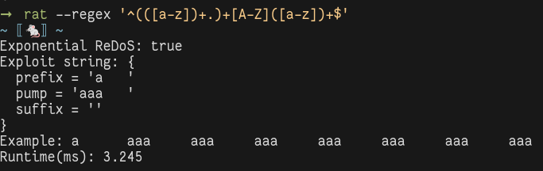

# rat - ReDoS Abstract Tester 🐁


<p align="center">
  
</p>

`rat` is a *sound* tool to detect exponential
[Regular Expression Denial of Service](https://owasp.org/www-community/attacks/Regular_expression_Denial_of_Service_-_ReDoS) (ReDoS) attacks.
Since the algorithm is proved to be sound, the tool cannot raise false
negatives.
This means that if `rat` determines that a regular expression is safe, it is
*impossible* for it to be exploited by an attacker.
Furthermore, `rat` takes advantage of efficient data structures to be
particularly fast.

The paper is available [here](https://link.springer.com/chapter/10.1007/978-3-031-10363-6_6).
The preprint PDF version is [here](https://phreppo.github.io/assets/pdfs/Parolini_ReDoS_Static_Analysis_Preprint.pdf).


> [!NOTE]
> `rat` now compiles to Javascript!
> See the [example project](./js-example).

## Build, Install and Run

To compile the project you need [opam](https://opam.ocaml.org/) installed, with
a version of the OCaml compiler >= 4.08.0.

```bash
make deps      # Install the dependencies.
make           # Build the project.
make js        # Build with Javascript as target.
make test      # Run the tests.
make install   # Install the executable.
```

To run `rat` without installing it:

``` bash
dune exec rat -- <args>
```

Run with `--help` to print the help message.
If there are no arguments, the command runs the interactive interpreter.

To run `rat` inside Docker:

``` bash
# Build (you just need to do this once)
docker build . -t rat:latest

# Run rat in interactive mode
docker run -it rat:latest

# Example of running rat with arguments
docker run rat:latest rat --regex '(a|a)*b'
```

## Example Analysis

Assume we have `rat` installed on the machine.
The following command analyzes the regular expression `(a|a)*b`:

``` bash
rat --regex '(a|a)*b'
```

The output should be similar to:

```bash
~ 🐁 ~
Exponential ReDoS: true
Exploit string: {
  prefix = ''
  pump = 'a'
  suffix = ''
}
Example: aaaaaaaaaaaaaaaaaaaaaaaaaaaaaaaaaaaaaaaaaaaaaaaaaaaaaaaaaaaaaaaaaaaaaaaaaaaaaaaaaaaaaaaaaaaaaaaaaaaaaaaaaaaaaaaaaaaaaaaaaaaaaaaa
Runtime(ms): 0.399
```

The analyzer reports that the regular expression is vulnerable to a ReDoS
attack, and prints an exploit string.
The runtime includes only the time to run the analysis, and does not take into
account the time to create a printable exploit string.
Since in order to do this we must run an exponential algorithm (to
build the minimal DFA recognizing the attack language), this can take a lot of
time.
The implementation of this algorithm can be improved considerably, and building
the exploit string is not a necessary part of the analysis.

## Analysis Options

It is possible to set the semantics of the matching with the option
`--semantics`.
If you are not sure, use the default option, which is `match`.
In this case, the analyzer assumes that the input regular expressions match
an input string even if just a prefix of the input string matches the regular
expression.
It is the default behaviour of matching engines, and corresponds to the
behaviour of the function `match` in the `re` module in Python.
If the `fullmatch` semantics is used, then the analyzer assumes that matching
engines compute the *language membership*.
The `fullmatch` semantics is the one used in the `fullmatch` function in Python.
If you read the paper about `rat` (available soon!) and you are interested in
trying the examples, you should use `--semantics fullmatch`, in all other
cases the `match` semantics is more appropriate.

It is possible to print the full attack language for a regular expression
with the option `--show-lang`.
Since this language is the specification of the attack words, it becomes quickly
difficult to read it.

## Limitations

`rat` cannot analyze a wide variety of non-regular constructs in regular
expressions, most notably *backreferences* and *lookarounds*.
Some non-regular constructs, such as `$`, are supported in a limited form.
Future improvements might fix this.

## Benchmarking

If you want to benchmark `rat` against other detectors, please use an OCaml
switch with `flambda` enabled.
For instance, this can be done with the following:
```bash
# Create a with with OCaml 4.14 and flambda.
opam switch create 4.14.0+flambda --package=ocaml-variants.4.14.0+options,ocaml-option-flambda

# Install dependencies, build, and install.
make deps
make
make install
```

## Authors

- [Francesco Parolini](https://phreppo.github.io/)
- [Antoine Miné](https://www-apr.lip6.fr/~mine/)
